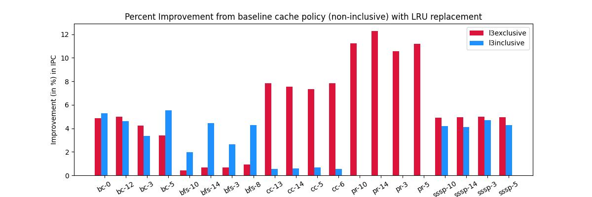

# Cache Optimization for Graph Algorithm Workload

We implemented various cache hierarchies with some modifications and found some interesting results.
We also compared various LLC Cache replacement policies for various types of Graph workloads 
including Breadth First Search(BFS), Connected Components(CC), Page Rank(PR),
Single Source Shortest Path(SSSP) and Betweenness Centrality(BC).

## Cache Hierarchies

There are three common cache hierarchies : inclusive, exclusive and non-inclusive.
Non-inclusive cache hierarchy was implemented in ChampSim repository we used.
We implemented [exclusive](ChampSim/cache_hierarchies/exclusive.cc), [l3exclusive](ChampSim/cache_hierarchies/l3exclusive.cc) and [l3inclusive](ChampSim/cache_hierarchies/l3inclusive.cc). l3exclusive and l3inclusive
cache hierarchies are minor modifications of exclusive and inclusive to reduce strictness
and make use of their positive effects. The modifications used reduced the overhead of writeback
in exclusive and used the low L1 miss latency of exclusive hierarchy. Below are more implementation 
details of the [l3inclusive](ChampSim/cache_hierarchies/l3inclusive.cc) and [l3exclusive](ChampSim/cache_hierarchies/l3exclusive.cc) cache hierarchies.

Here we mention the differences in the policy implemented from non-inclusive policy.

### Cache Hierarchy - exclusive

- In handle_fill
	If we are at LLC, it is bypassed and data is sent directly to upper level cache.
	For L2C or L1I or L1D, the victim is sent to LLC using a writeback packet.
- In handle_writeback

	If writeback packet is recieved at L2, the victim is copied back to L3.
- In handle_read
	
	If there is a read hit in LLC, the data is returned to upper level cache and the entry is
	invalidated from LLC.

### Cache Hierarchy - l3inclusive

- Abstraction 
	LLC cache is a super set of L1 and L2 caches. No such guarantee is provided for the relation between L1 and L2

- Deletion from LLC

	Data requested from DRAM is received in LLC replacing the victim cache line. This
	cache is also simultaneously deleted from L1 and L2 caches. If the victim cache
	line is dirty in L1 or L2 then writeback packet is sent to DRAM accordinly. 
	The latest copy of the line is present in the highest cache block, so that line is
	sent as the writeback packet
- Deletion from L1/L2

	If the cache line is clean then we simply invalidate the line. If the line is dirty
	in either of the caches, we sent an appropriate writeback message to LLC cache. 

### Cache Hierarchy - l3exclusive

- In handle_fill

	If we are at LLC, it is bypassed and data is sent directly to upper level cache.
	For L2C, the victim is sent to LLC using a writeback packet.
- In handle_writeback

	If writeback packet is recieved at L2, the victim is copied back to L3.
- In handle_read
	
	If there is a read hit in LLC, the data is returned to upper level cache and the entry is
	invalidated from LLC.

## Comparing cache hierarchies for various workloads

Here is the summary of the Cache Hierarchy with highest improvement in IPC.
This data is for LRU replacement policy.

| Trace Type | Cache Hierarchy | Percentage Improvement |
| :--: | :--: | :--: |
| BC | l3inclusive,l3exclusive |  4-6 |
| BFS | l3inclusive | 2-4 |
| CC | l3exclusive | 6-8 |
| PR | l3exclusive | 10-12 |
| SSSP | l3exclusive $\gtrsim$ l3inclusive | 4-6 |

Here are the graphs for percentage improvement of these cache hierarchy policies
over non-inclusive hierarchy for LRU cache replacement policy.

## Cache Replacement Policies

Besides the srrip, ship, drrip, lru which were present in the ChampSim directory, we added
hawkeye replacement policy also ([reference](https://github.com/hyerania/Belady-Cache-Replacement/blob/master/Reports/Project_Final_Report.pdf)).

In addition to this, we also implemented LFU and FIFO. We also implemented a hybrid
of LFU and LRU, lfru. We maintained both LFU and LRU score(0 being least recent)
Then we used a weighted combination of scores of LFU and LRU to get the victim.
This way, we are able to keep the address which is used frequently from being removed from
cache. But this also gives a weight to the ones which were accessed very recently and had
low frequency because of that.

We compared different cache replacement policies across different traces and cache hierarchies.
The IPC value for BFS traces does not vary significantly across different replacement policies. 
It's IPC performance is only slightly affected by cache_hierarchy policy

L3inclusive does not show significant performance deviation when changing replacement policies. 

IPC performance of L3 exclusive varies a lot with different replacement policy. Here is the order:

	Hawkeye $\approx$ LFU $<$ Ship $\lesssim$ DRRIP $<$ Fifo $\approx$ LFU $\approx$ LFRU

Here is the graph of the comparison of the same.

More graphs for other traces are present in the file [plot.ipynb](results/plot.ipynb)

## Team Members

| Roll Number | Name |
| :---: | :---: |
| 210050026 | Atishay Jain |
| 210050038 | Chaitanya Agarwal |
| 210050085 | Khushang Singla |
